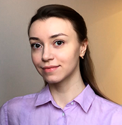

# Alexandra Hurbanava

**e-mail:** sasha.hurbnva@gmail.com
**github:** GSasha9
**discord:** alexandra_33767

## About me
My name is Alexandra Hurbanava, and I am a student in a retraining program specializing in Web Design and Computer Graphics. I am studying the JavaScript programming language, have an interest in web development, and possess experience in website layout using HTML, CSS, SCSS. I aim to expand my knowledge in front-end development for future employment in this field.

## Skills
* HTML
* CSS
* SCSS
* Java Script
* PHP basics
* SQL
* WordPress
* Figma, Photoshop, CorelDraw, Illustrator

## Сode examples
WeIrD StRiNg CaSe
```function toWeirdCase(string) {
    let arrOfWords = string.split(' ');
    arrOfWords = arrOfWords.map(function(el) {
    let arrLetters = el.split('');
    arrLetters = arrLetters.map(function(elem, idx) {
      if(idx%2 === 0){
        return elem.toUpperCase();
      } else {
        return elem.toLowerCase();
      }
      })
      return el = arrLetters.join('');
    }
  )
  return arrOfWords.join(' ');
}
```

**link to a file with code for a simple game "Guess the word"**
https://github.com/GSasha9/guess_the_word_game/blob/main/pr.js

## Education
2023-2024 - Retraining at the higher education level in the specialty of web design and computer graphics in School of Business of Belarusian State University

## Languages
English B1